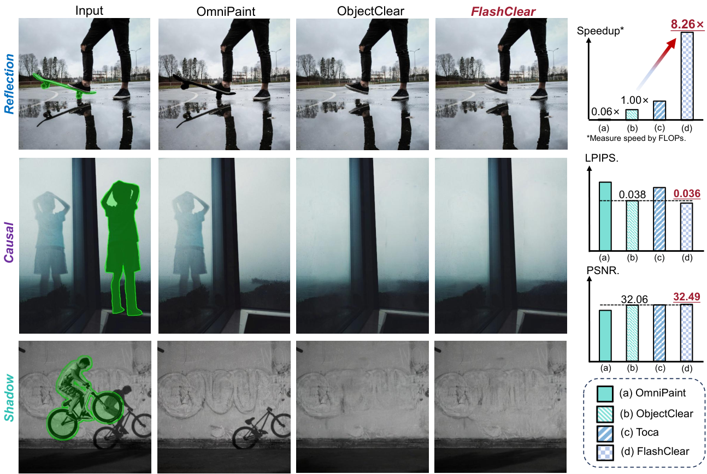
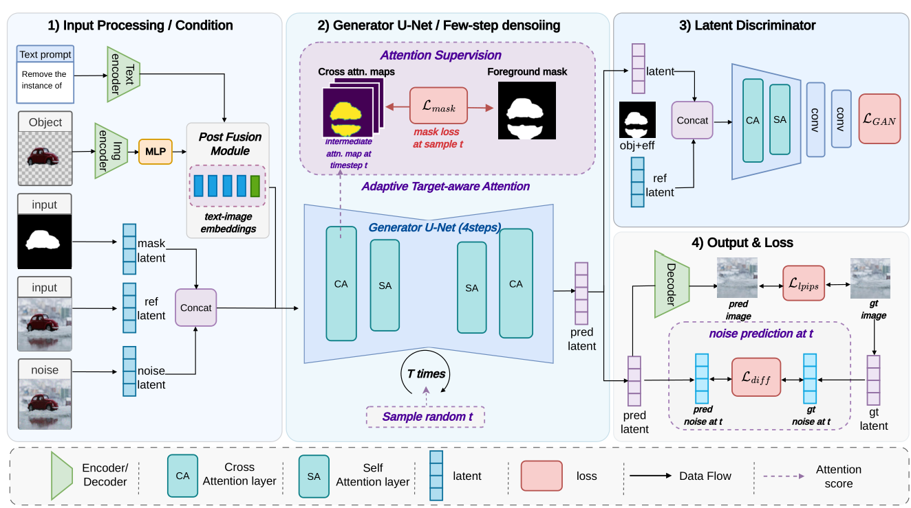
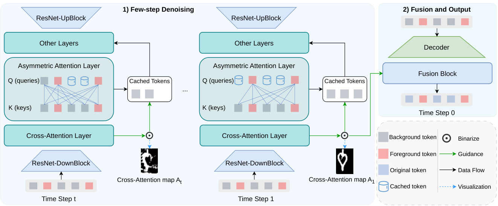
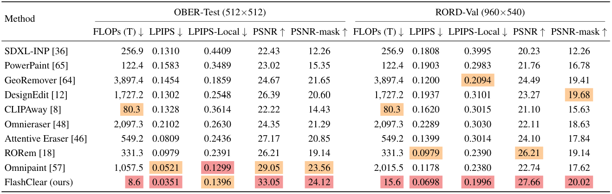
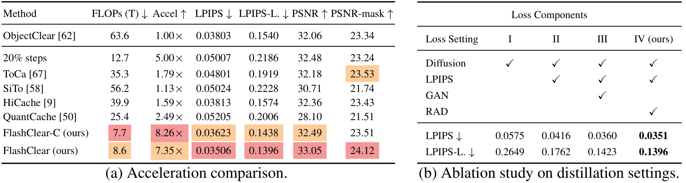
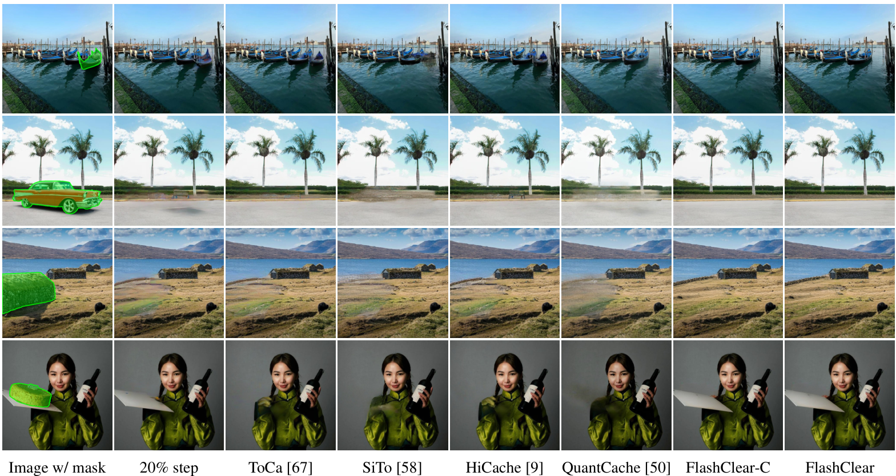
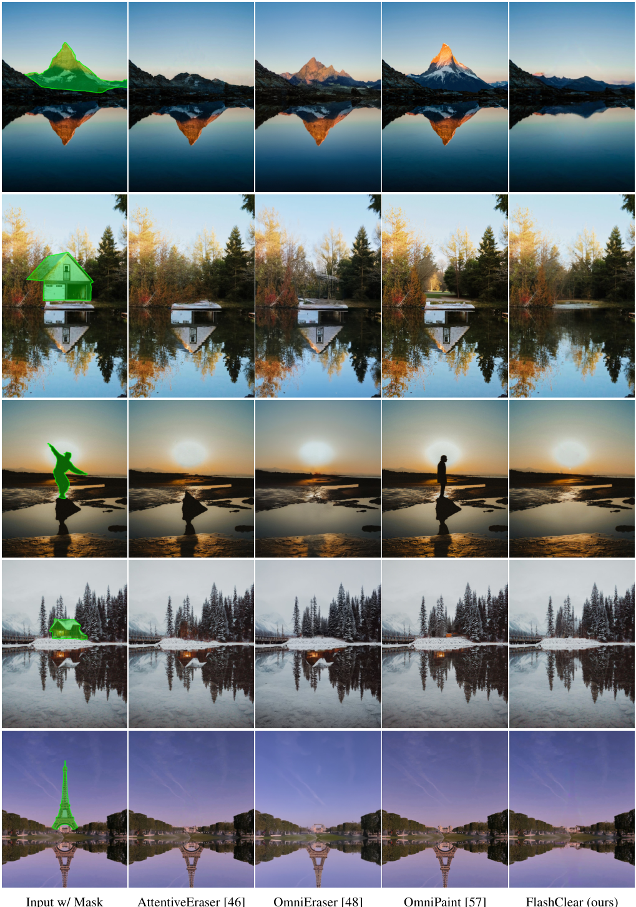

# FlashClear: Ultra-Fast Image Content Removal via Efficient Step Distillation and Feature Caching

[Yixin Tang](https://YOU-EEE.github.io/), [Jiawei Guo](https://guocalix.github.io/), [Junxian Li](https://lijunxian111.github.io), [Zhiteng Li](https://arxiv.org/search/cs?searchtype=author&query=Li,+Z), [Jixin Zhao](https://arxiv.org/search/cs?searchtype=author&query=Zhao,+J), [Bingya Zhang](https://arxiv.org/search/cs?searchtype=author&query=Zhang,+B), [Chenbo Wang](https://arxiv.org/search/cs?searchtype=author&query=Wang,+C), [Yulun Zhang](https://yulunzhang.com), [Shangchen Zhou](https://arxiv.org/search/cs?searchtype=author&query=Zhou,+S)

"FlashClear: Ultra-Fast Image Content Removal via Efficient Step Distillation and Feature Caching", arXiv 2026

<p align="center">
  <a href="https://github.com/GuoCalix/FlashClear/releases"></a>
  <a href="https://github.com/GuoCalix/FlashClear"></a>
  <a href="https://arxiv.org/abs/2605.09003"></a>
  <a href="https://github.com/GuoCalix/FlashClear/stargazers"></a>
</p>

[Project] [Supplementary Material] [Model]

#### News

- **2026-05-12:** This repository is released.

---

> Recently, diffusion-based object removal models have achieved impressive results in eliminating objects and their associated visual effects. However, they indiscriminately denoise all tokens across all timesteps, ignoring that removal usually involves small foreground regions. This strategy introduces substantial computational overhead and prolonged inference times. To overcome this computational burden, we propose a latent discriminator to implement Region-aware Adversarial Distillation (RAD), yielding a highly efficient few-step model named FlashClear. Furthermore, tailored to few-step diffusion models, we propose FPAC (Foreground-Prioritized Asymmetric Attention and Caching), a training-free acceleration strategy. Extensive experiments demonstrate that our framework provides massive acceleration while maintaining or exceeding the performance of our base model, ObjectClear. Notably, on the OBER benchmark, FlashClear achieves up to 8.26x and 122x speedup over ObjectClear and OmniPaint, respectively, while maintaining high visual quality and fidelity.



---

### Pipeline





---

## TODO

- [ ] Release inference/test code.
- [ ] Release model weights.

## Contents

1. [Testing](#testing)
2. [Results](#results)
3. [Citation](#citation)
4. [Acknowledgements](#acknowledgements)

## <a name="testing"></a>Testing

TBD

## <a name="results"></a>Results

We present the performance of our proposed FlashClear model and its cached variant, FlashClear-C.

<details open>
<summary>Quantitative Results (click to expand)</summary>

- Results in Tab. 1 of the main paper

  

- Results in Tab. 4 of the main paper

  

</details>

<details open>
<summary>Qualitative Results (click to expand)</summary>

- Results in Fig. 6 of the main paper

  

- Results in Fig. 16 of the appendix

  

</details>

## <a name="citation"></a>Citation

If you find our model or code helpful in your research or work, please cite the following paper.

```bibtex
@article{tang2026flashclear,
      title={FlashClear: Ultra-Fast Image Content Removal via Efficient Step Distillation and Feature Caching},
      author={Yixin Tang and Jiawei Guo and Junxian Li and Zhiteng Li and Jixin Zhao and Bingya Zhang and Chenbo Wang and Yulun Zhang and Shangchen Zhou},
      journal={arXiv preprint arXiv:2605.09003},
      year={2026}
}
```

## <a name="acknowledgements"></a>Acknowledgements

This project builds on numerous model repositories. We thank [ObjectClear](https://github.com/zjx0101/ObjectClear) for the research ideas that inspired this work.
